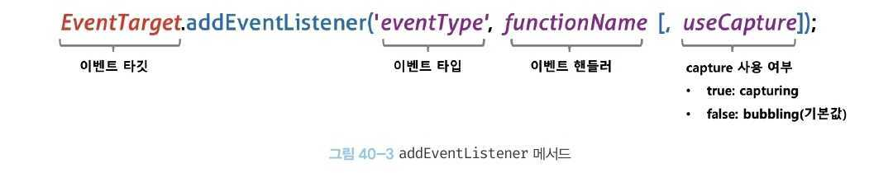
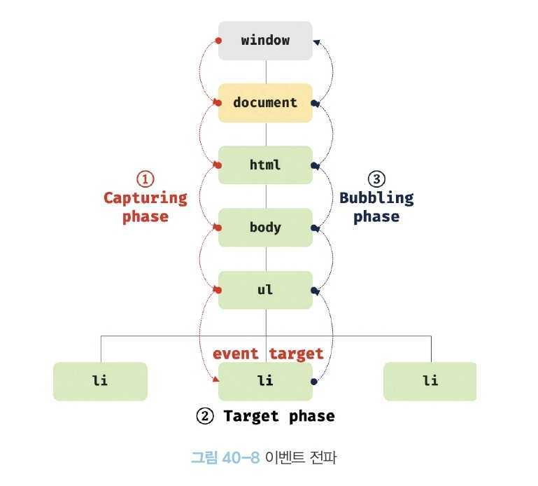

# 40. 이벤트

## 1. 이벤트 드리븐 프로그래밍

🔥 용어 설명

- 이벤트 핸들러: 애플리케이션이 특정 타입의 이벤트에 대해 반응하여 어떤 일을 하고 싶다면 해당하는 타입의 **이벤트가 발생했을 때 호출될 함수**를 브라우저에게 알려 호출을 위임한다. 이때 이벤트가 밸생했을 때 호출될 함수를 **이벤트 핸들러(event handler)**라 한다.
- 이벤트 핸들러 등록: 이벤트가 발생했을 때 <span style="color: red">브라우저에게 이벤트 핸들러의 호출을 위임</span>하는 것을 **이벤트 핸들러 등록**이라 한다.
- 이벤트와 그에 대응하는 함수(이벤트 핸들러)를 통해 사용자와 애플리케이션은 상호작용을 할 수 있다. 이와 같이 **프로그램의 흐름을 이벤트 중심으로 제어하는 프로그래밍 방식**을 **이벤트 드리븐 프로그래밍**이라 한다.

## 2. 이벤트 타입

- 이벤트 타입은 이벤트의 종류를 나타내는 문자열이다.
- 이벤트 타입은 약 200여가지가 있다.
- 참고자료: https://en.wikipedia.org/wiki/DOM_event

## 3. 이벤트 핸들러 등록

- 이벤트 핸들러를 등록하는 방법은 3가지다.

### 3.1 이벤트 핸들러 어트리뷰트 방식(레거시)

- `HTML` 요소의 어트리뷰트 중에는 이벤트에 대응하는 Event Handler Attribute 가 있다.
- Event Handler Attribute의 이름은 `onclick과` 같이 on 접두사와 이벤트의 종류를 이벤트 타입으로 이루어져 있다. (ex. onclick, onfocus)
- Event Handler Attribute의 값으로 함수 호출문 등의 문(statement)을 할당하면 이벤트 핸들러가 등록된다.

```html
<!DOCTYPE html>
<html>
  <body>
    <button onclick="sayHi('Han')">클릭</button>
    <!-- 함수 호출! -->
    <script>
      function sayHi(name) {
        console.log(`Hi!, ${name}`);
      }
    </script>
  </body>
</html>
```

잘 몰랐던 내용: p759

### 3.2 이벤트 핸들러 프로퍼티 방식

- `window` 객체와 `Document`, `HTMLElement` 타입의 `DOM` 노드 객체는 / 이벤트에 대응하는 이벤트 핸들러 프로퍼티를 가지고 있다.
- **이벤트 핸들러 프로퍼티**에 함수를 바인딩하면 이벤트 핸들러가 등록된다.
- 이벤트 핸들러를 등록하기 위해서는 1) 이벤트를 발생시킬 객체인 이벤트 타깃과 2) 이벤트의 종류를 나타내는 문자열인 이벤트 타입 그리고 3) 이벤트 핸들러를 지정할 필요가 있다.

```html
<!DOCTYPE html>
<html>
  <body>
    <button>클릭</button>
    <script>
      const $button = document.querySelector("button");

      $button.onclick = function () {
        console.log("button click!");
      };
    </script>
  </body>
</html>
```

잘 몰랐던 내용: p761

### 3.3 addEventListener 메서드 방식

- `EventTarget.prototype.addEventListener` 메서드를 사용하여 이벤트 핸들러를 등록할 수 있다.



```html
<!DOCTYPE html>
<html>
  <body>
    <button>클릭</button>
    <script>
      const $button = document.querySelector("button");

      // 이벤트 핸들러 프로퍼티 방식
      //   $button.onclick = function () {
      //     console.log("button click!");
      //   };

      // addEventListener 메서드 방식
      $button.addEventListener("click", function () {
        console.log("button click!");
      });
    </script>
  </body>
</html>
```

🔥 주의!

- 동일한 `HTML` 요소에서 발생한 동일한 이벤트에 대해 1) 이벤트 핸들러 프로퍼티 방식과 2) addEventListener 메서드 방식을 모두 사용하여 이벤트 핸들러를 등록할 경우
  =>>> addEventListener 메서드 방식은 이벤트 핸들러 프로퍼티에 바인딩된 이벤트 핸들러에 아무런 영향을 주지 않기 때문에 **2개의 이벤트 핸들러가 모두 호출된다.**

- addEventListener 메서드 방식은 하나 이상의 이벤트 핸들러를 등록할 수 있다. 등록된 순서대로 호출된다.
- 단, addEventListener 메서드를 통해 참조가 동일한 이벤트 핸들러를 중복 등록하면 하나의 이벤트 핸들러만 등록된다.

```html
<!DOCTYPE html>
<html>
  <body>
    <button>클릭</button>
    <script>
      const $button = document.querySelector("button");

      const handleClick = () => console.log("button click!");

      // 참조가 동일한 이벤트 핸들러를 중복 등록하면 하나의 핸들러만 등록된다.
      $button.addEventListener("click", handleClick);
      $button.addEventListener("click", handleClick);
    </script>
  </body>
</html>
```

## 4. 이벤트 핸들러 제거

- `addEventListener` 메서드로 등록한 이벤트 핸들러를 제거하려면 `EventTarget.prototype.removeEventListener` 메서드를 사용한다.

```html
<!DOCTYPE html>
<html>
  <body>
    <button>클릭</button>
    <script>
      const $button = document.querySelector("button");

      const handleClick = () => console.log("button click!");

      // 이벤트 핸들러 등록
      $button.addEventListener("click", handleClick);

      // 이벤트 핸들러 제거
      // addEventListener 메서드에 전달한 인수와 removeEventListener 메서드에 전달한 인수가 일치하지 않으면 이벤트 핸들러가 제거되지 않는다.
      $button.removeEventListener("click", handleClick, true); // 실패
      $button.removeEventListener("click", handleClick); // 성공
    </script>
  </body>
</html>
```

- ‼️ 이벤트 핸들로 프로퍼티 방식으로 등록한 이벤트 핸들러는 removeEventListener 메서드로 제거할 수 없다. **이벤트 핸들로 프로퍼티 방식으로 등록한 이벤트 핸들러를 제거하려면 이벤트 핸들러에 `null`을 할당한다.**

잘 몰랐던 내용: 무명함수를 이벤트 핸들러로 등록한 경우 제거할 수 없다. p766

## 5. 이벤트 객체

- 이벤트가 발생하면 이벤트에 관련한 다양한 정보를 담고 있는 이벤트 객체가 동적으로 생성된다.
- **생성된 이벤트 객체는 이벤트 핸들러의 첫 번째 인수로 전달된다.**

```html
<!DOCTYPE html>
<html>
  <body>
    <p>클릭하세요. 클릭한 곳의 좌표가 표시됩니다.</p>
    <em class="message"></em>
    <script>
      const $msg = document.querySelector(".message");

      // 클릭 이벤트에 의해 생성된 이벤트 객체는 이벤트 핸들러의 첫 번째 인수로 전달된다.(브라우저가 이벤트 핸들러를 호출할 때 이벤트 객체를 인수로 전달한다)
      function showCoords(e) {
        $msg.textContent = `clientX: ${e.clientX}, clientT: ${e.clientY}`;
      }

      document.onclick = showCoords;
    </script>
  </body>
</html>
```

잘 몰랐던 내용:

- 이벤트 핸들러 어트리뷰트 방식의 경우 `event` 가 아닌 다른 이름으로는 이벤트 객체를 전달하지 못한다! (p768)
- 이벤트가 발생하면 암묵적으로 생성되는 이벤트 객체도 생성자 함수에 의해 생성된다.!! 이벤트 타입에 따라 그에 상응하는 이벤트 객체가 생성된다.(p770, 772, 773)

### 5.1 마우스 정보 취득

- click, dbclick, mousedown, mouseup, mousemove, mouseenter, mouseleave 이벤트가 발생하면 생성되는 MouseEvent 타입의 이벤트 객체는 다음과 같은 고유의 프로퍼티를 갖는다.
  - 마우스 포인터의 좌표 정보를 나타내는 프로퍼티: screenX/screenY, clientX/clientY, pageX/pageY, offsetX/offsetY

❓이런 정보를 가지고 무엇을 할 수 있을까? DOM 요소를 드래그하여 이동시켜야 할 때

잘 몰랐던 내용:

- transform3d는 GPU를 사용하므로 absolute의 top, left 를 사용하는 것보다 빠르다. (p777)

### 5.2 키보드 정보 취득

- keydown, keyup, keypress 이벤트가 발생하면 생성되는 KeyboardEvent 타입의 이벤트 객체는 altKey, ctrlKey, shiftKey, metaKey, key, keyCode 같은 고유의 프로퍼티를 갖는다.

❓이런 정보를 가지고 무엇을 할 수 있을까? input 요소의 입력 필드에 엔터 키가 입력되면 현재까지 입력 필드에 입력된 값을 출력하는 예제를 만들어보자.

## 6. 이벤트 전파

🔥 정의
이벤트 전파: `DOM` 트리 상에 존재하는 `DOM` 요소 노드에서 발생한 이벤트는 `DOM` 트리를 통해 전판된다. 이를 이벤트 전파(Event Propagation)라고 한다.

```html
<!DOCTYPE html>
<html lang="en">
  <body>
    <ul id="fruits">
      <li id="apple">apple</li>
      <li id="banana">banana</li>
      <li id="orange">orange</li>
    </ul>
  </body>
</html>
```

- ul 요소의 두 번째 자식요소인 li 요소클 클릭하면 이벤트가 발생한다. 이때 생성된 이벤트 객체는 이벤트를 발생시킨 DOM 요소인 이벤트 타깃을 중심으로 DOM 트리를 통해 전파된다. 이벤트 전파는 이벤트 객체가 전파되는 방향에 따라 다음과 같이 3단계로 구분할 수 있다.



1. 캡쳐링 단계: 이벤트가 상위 요소에서 하위 요소 방향으로 전파
2. 타깃 단계: 이벤트가 이벤트 타깃에 도달
3. 버블링 단계: 이벤트가 하위 요소에서 상위 요소 방향으로 전파

## 7. 이벤트 위임

🔥 정의
이벤트 위임: 여러 개의 하위 DOM 요소에 각각 이벤트 핸들러를 등록하는 대신 **하나의 상위 요소**에 이벤트 핸들러를 등록하는 방법을 말한다.

- 이벤트는 Event Target은 물론 상위 `DOM` 요소에서도 캐치할 수 있다.
- 이벤트 위임을 통해 상위 `DOM` 요소에 이벤트 핸들러를 등록하면 여러 개의 하위 `DOM` 요소에 이벤트 핸들러를 등록할 필요가 없다.
- 또한 동적으로 `DOM` 요소를 추가하더라도 일일이 추가된 `DOM` 요소에 이벤트 핸들러를 등록할 필요가 없다.

## 8. DOM 요소의 기본 동작

### 8.1 DOM 요소의 기본 동작 중단

- `DOM` 요소는 저마다 기본 동작이 있다. 예를 들어, a 요소를 클릭하면 href 어트리뷰트에 지정된 링크로 이동하고, checkbox 또는 radio 요소를 클릭하면 체크 또는 해제된다.
- **이벤트 객체의 `preventDefault` 메서드는 이러한 `DOM` 요소의 기본동작을 중단시킨다.**

### 8.2 이벤트 전파 방지

- 이벤트 객체의 `stopPropagation` 메서드는 이벤트 전파를 중지시킨다.
- 이처럼 보통 `stopPropagation` 메서드는 하위 `DOM` 요소의 이벤트를 개별적으로 처리하기 이벤트의 전파를 중단시킨다.

## 9. 이벤트 핸들러 내부의 this

### 9.1 이벤트 핸들러 어트리뷰트 방식

### 9.2 이벤트 핸들러 프로퍼티 방식과 addEventListener 방식

## 10. 이벤트 핸들러에 인수 전달

- 함수에 인수를 전달하려면 함수를 호출할 때 전달해야 한다.

  - 이벤트 핸들러 어트리트뷰트 방식은 함수 호출문을 사용할 수 있기 때문에 인수를 전달할 수 있지만
  - 이벤트 핸들러 프로퍼티 방ㅎ식과 addEventListener 메서드 방식의 경우 이벤트 핸들러를 브라우저가 호출하기 때문에 함수 호출문이 아닌 함수 자체를 등록해야 한다. 따라서 인수를 전달할 수 없다.

- 그럼 어떻게 해야 전달할 수 있을까?
  => 이벤트 핸들러 내부에서 함수를 호출하면서 인수를 전달할 수 있다.
  => 또는 이벤트 핸들러를 반환하는 함수를 호출하면서 인수를 전달할 수 있다.

```html
<!DOCTYPE html>
<html lang="en">
  <body>
    <label>User Name <input type="text" /></label>
    <em class="message"></em>

    <script>
      const MIN_USER_NAME_LENGTH = 5;
      const $input = document.querySelector("input[type=text]");
      const $msg = document.querySelector(".message");

      const checkUserNameLength = (min) => {
        $msg.textContent =
          $input.value.length < min ? `이름은 ${min}자 이상 입력해주세요` : "";
      };

      // 이벤트 핸들러 내부에서 함수를 호출하면서 인수를 전달한다.
      $input.onblur = () => {
        checkUserNameLength(MIN_USER_NAME_LENGTH);
      };
    </script>
  </body>
</html>
```

```html
<!DOCTYPE html>
<html lang="en">
  <body>
    <label>User Name <input type="text" /></label>
    <em class="message"></em>

    <script>
      const MIN_USER_NAME_LENGTH = 5;
      const $input = document.querySelector("input[type=text]");
      const $msg = document.querySelector(".message");

      // 이벤트 핸들러를 반환하는 함수
      const checkUserNameLength = (min) => (e) => {
        $msg.textContent =
          $input.value.length < min ? `이름은 ${min}자 이상 입력해주세요` : "";
      };

      // 이벤트 핸들러를 반환하는 함수를 호출하면서 인수를 전달한다.
      $input.onblur = checkUserNameLength(MIN_USER_NAME_LENGTH);
    </script>
  </body>
</html>
```

## 11. 커스텀 이벤트

### 11.1 커스텀 이벤트 생성

- `Event`, `UIEvent`, `MouseEvent` 같은 이벤트 생성자 함수를 호출하여 명시적으로 생성한 이벤트 객체는 임의의 이벤트 타입을 지정할 수 있다.
- 이처럼 개발자의 의도로 생성된 이벤트를 **커스텀 이벤트**라 한다.

‼️ 잘몰랐던 내용

- 이벤트 생성자 함수는 첫 번째 인수로 이벤트 타입을 나타내는 '문자열'을 전달받는다.
  - 이때 이벤트 타입을 나타내는 문자열은 1) 기존 이벤트 타입을 사용할 수도 있고, 2) 기존 이벤트 타입이 아닌 임의의 문자열을 사용하여 새로운 이벤트 타입을 지정할 수도 있다.
  - 2)번의 경우에는 일반적으로 `CustomEvent` 이벤트 생성자 함수를 사용한다.

### 11.2 커스텀 이벤트 디스패치

- 생던된 커스텀 이벤트는 `dispatchEvent` 메서드로 디스패치(이벤트를 발생시키는 행위)할 수 있다.
- `dispatchEvent` 메서드에 이벤트 객체를 인수로 전달하면서 호출하면 인수로 전달한 이벤트 타입의 이벤트가 발생한다.
